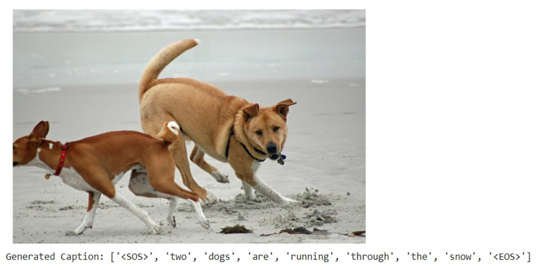
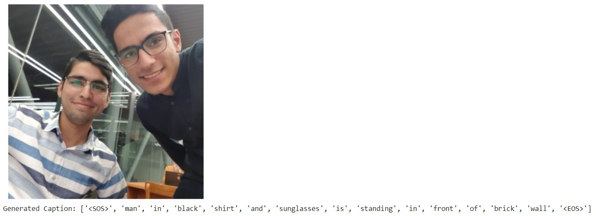

# Image Captioning Project

This image captioning project is inspired by the article "Image Captioning" by Vikram Mullachery and Vishal Motwani [Read the article](https://arxiv.org/pdf/1805.09137.pdf). The dataset used is Flickr8k, consisting of 8091 images and a caption file with 40455 sentences.

## Dataset Processing and Model Architecture

The project involves preprocessing the dataset using functions like `get_loader` and classes like `FlickrDataset` and `Vocabulary`. The model architecture consists of an `EncoderCNN` utilizing ResNet18 for image feature extraction and a corresponding `DecoderRNN` (LSTM) for caption generation.

## Hyperparameter Configuration and Training

Hyperparameters are set based on the information from the article. The model is trained for 20 epochs with a hidden layer size of 256 and a learning rate of 4e-4. The training loop involves the Adam optimizer and cross-entropy loss calculation for caption generation.

## Results and Model Evaluation

Two models are defined: one with frozen ResNet18 weights and another with newly trained weights. The frozen model outperforms slightly. Evaluation metrics include training and validation loss graphs. The project demonstrates a positive performance, generating meaningful captions for test images.

Feel free to explore the provided Jupyter notebooks for a more detailed examination of the project results. If you have any questions or need clarification, please don't hesitate to reach out.

Happy coding!

